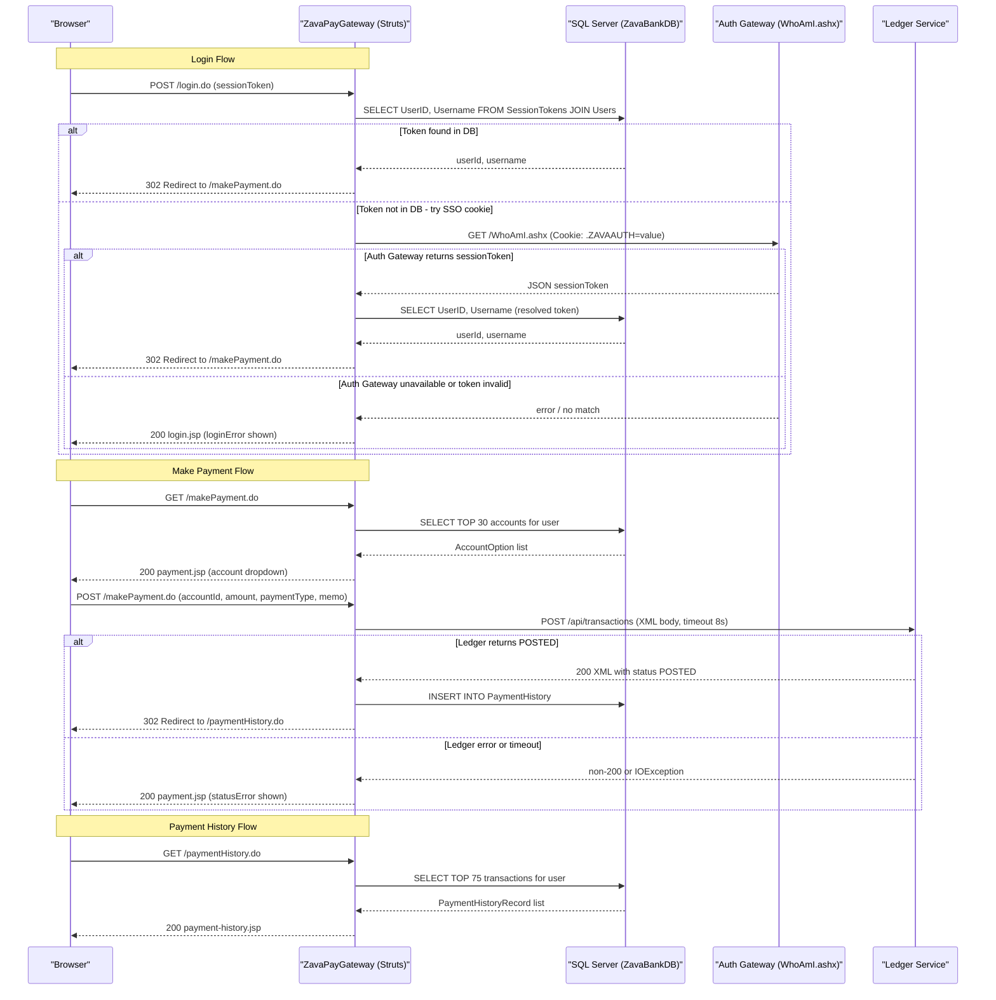

# API & Service Communication Contracts

ZavaPayGateway exposes four browser-facing Struts action endpoints (`*.do`) for login, payment submission, payment history, and health, and acts as a client to two downstream HTTP services: the Auth Gateway and the Ledger Service.

## Service Catalog

| Service | Port | Category | Purpose |
|---------|------|----------|---------|
| ZavaPayGateway | 8080 (servlet container) | API Layer / Business | Java EE web application; handles user authentication, payment form rendering, payment submission, and history display |
| Auth Gateway (external) | 8080 | Infrastructure | .NET service that resolves a `.ZAVAAUTH` FormsAuth cookie to a session token via `WhoAmI.ashx` |
| Ledger Service (external) | 8080 | Business | Downstream REST/XML service that records and confirms payment transactions via `POST /api/transactions` |
| SQL Server – ZavaBankDB (external) | 1433 | Infrastructure | Relational database storing users, session tokens, accounts, and payment history |

## API Endpoints Inventory

| Service | Method | Path | Request Type | Response Type | Notes |
|---------|--------|------|-------------|--------------|-------|
| ZavaPayGateway | GET / POST | `/login.do` | `LoginForm` (sessionToken field) | Redirect to `/makePayment.do` or re-render `login.jsp` | Entry point; `index.jsp` redirects here |
| ZavaPayGateway | GET | `/makePayment.do` | None (session-validated) | `payment.jsp` with account dropdown | Loads accounts from DB; redirects to `/login.do` if unauthenticated |
| ZavaPayGateway | POST | `/makePayment.do` | `PaymentForm` (accountId, amount, paymentType, memo) | Redirect to `/paymentHistory.do` on success, or re-render `payment.jsp` on error | Posts XML transaction to Ledger Service |
| ZavaPayGateway | GET | `/paymentHistory.do` | None (session-validated) | `payment-history.jsp` with transaction rows | Fetches top 75 transactions from DB; redirects to `/login.do` if unauthenticated |
| ZavaPayGateway | GET | `/health.do` | None | `health.jsp` | Simple liveness indicator; no authentication required |

## Management & Observability Endpoints

| Service | Endpoint | Custom Metrics |
|---------|----------|----------------|
| ZavaPayGateway | `/health.do` → `health.jsp` | None — renders a static HTML page with "ZavaPayGateway - Online" |

No Spring Boot Actuator, Micrometer, OpenTelemetry, or any other observability instrumentation is present. There are no `/metrics`, `/actuator/health`, or structured logging endpoints.

## DTOs & Contracts

**Form Beans (request-side):**

- `LoginForm` (extends `ActionForm`) — carries the `sessionToken` string submitted by the login form. Mutable JavaBean, no immutability guarantee.
- `PaymentForm` (extends `ActionForm`) — carries `accountId` (int), `amount` (String), `paymentType` (String), and `memo` (String). Mutable JavaBean.

**Domain / Response Models:**

- `SessionUser` — carries `userId` (int) and `username` (String) resolved from the SSO session. Set on the `HttpSession` keyed under `SsoSessionService.SESSION_USER`. Not a serialized DTO; only used in-process.
- `AccountOption` — carries `accountId`, `accountNumber`, `accountType`, and `balance` (String). Populated from a SQL query and placed in request scope as the `accountOptions` list for the payment form dropdown.
- `PaymentHistoryRecord` — carries `transactionId`, `accountNumber`, `amount`, `paymentType`, `referenceNumber`, `transactionDate`, and `status`. Placed in request scope as `historyRows` for the history view.

**External Contract (outbound, Ledger Service):**

The payment payload sent to the Ledger Service is a hand-built XML string:
```
<transactionRequest>
  <debitAccountId>{id}</debitAccountId>
  <creditAccountId>{settlementAccountId}</creditAccountId>
  <amount>{amount}</amount>
  <description>{memo}</description>
  <referenceNumber>{referenceNumber}</referenceNumber>
</transactionRequest>
```
The Ledger Service responds with XML; a successful post is detected by checking whether the response body contains `<status>POSTED</status>`.

There are no OpenAPI/Swagger specifications, protobuf schemas, or GraphQL schemas. No Jackson or any JSON serialization library is used; the only serialized format is the hand-crafted XML above.

## Communication Patterns

**Synchronous HTTP (outbound):**

- **Auth Gateway** — `SsoSessionService` calls `GET http://zava-auth-gateway:8080/WhoAmI.ashx` forwarding the `.ZAVAAUTH` cookie. Uses raw `java.net.HttpURLConnection` with a connect timeout of 8 000 ms and a read timeout of 8 000 ms. This is a fallback path; the primary path resolves the session token directly from the `SessionTokens` table.
- **Ledger Service** — `PaymentAction` calls `POST http://zava-ledger:8080/api/transactions` with `Content-Type: application/xml`. Connect timeout: 8 000 ms; read timeout: 8 000 ms. No retry logic or circuit-breaker is implemented; a non-200 response or network error is treated as a payment failure.

**Database (synchronous, JDBC):**

- Direct `PreparedStatement` calls via `PayGatewayConnectionFactory.openConnection()` (no connection pooling library declared; relies on `DriverManager`).

**Asynchronous patterns:** None. All communication is synchronous request/response.

**Resilience patterns:** No circuit breaker, retry, or bulkhead patterns are implemented. The only resilience mechanism is the hardcoded 8-second timeout on outbound HTTP calls.

**Service discovery:** Services are addressed by hardcoded hostnames configured in `paygateway.properties` (`zava-auth-gateway`, `zava-ledger`, `sqlserver`). No service registry or DNS-based discovery is used.

**API gateway:** ZavaPayGateway itself acts as a lightweight aggregating gateway, calling both the Auth Gateway and the Ledger Service and combining their results into the user-facing web interface.

**Security posture:** There is no TLS/HTTPS configuration at the application layer; transport security depends entirely on the deployment environment. There is no OAuth2, JWT, or HTTP Basic Auth at the API level. Session-based authentication is implemented using a custom `SessionTokens` database table; all non-health endpoints perform a session check and redirect unauthenticated requests to `/login.do`. The login form also accepts a token submitted via the `sessionToken` query parameter or the `X-Session-Token` HTTP header, which bypasses the SSO cookie flow.

## Service Technology Matrix

| Capability | ZavaPayGateway |
|-----------|----------------|
| Web Framework | Apache Struts 1.3 (ActionServlet front-controller) |
| Data Access | Raw JDBC via `DriverManager` (no ORM, no connection pool) |
| Service Discovery | None (hardcoded hostnames in properties file) |
| Gateway Functionality | Partial — aggregates Auth Gateway and Ledger Service calls |
| Health / Actuator | Custom `/health.do` (static HTML only) |
| Caching | None |
| Metrics / Observability | None |
| Async Messaging | None |

## Service Communication Sequence


