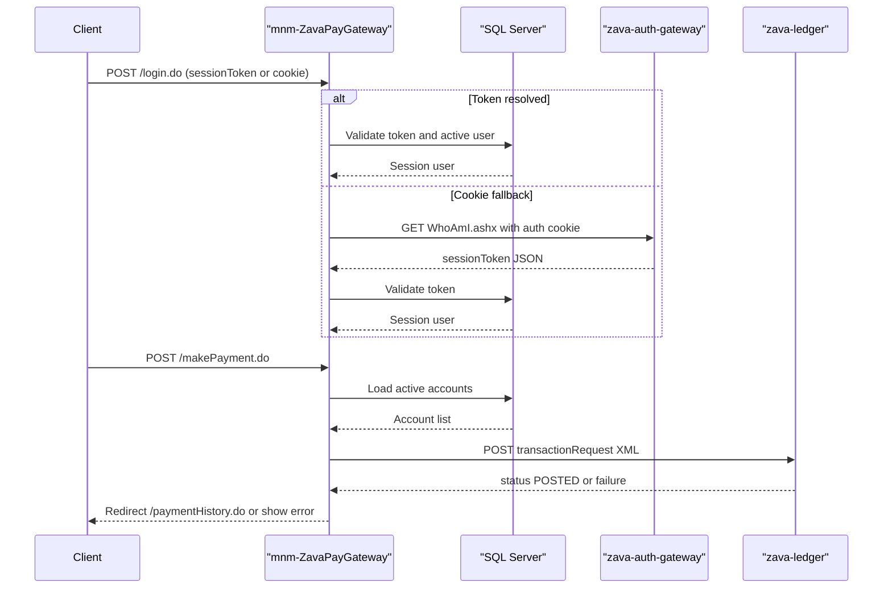

# API & Service Communication Contracts

The application exposes Struts action endpoints over server-rendered web flows and uses synchronous HTTP/JDBC communication with external systems.

## Service Catalog

| Service | Port | Category | Purpose |
|---|---|---|---|
| mnm-ZavaPayGateway | 8080 (container) | API Layer | Handles login, payment initiation, history, and health endpoints |
| zava-auth-gateway | 8080 (external) | Business | Resolves SSO cookie to session token via WhoAmI endpoint |
| zava-ledger | 8080 (external) | Business | Receives posted payment transactions |

## API Endpoints Inventory

| Service | Method | Path | Request Type | Response Type |
|---|---|---|---|---|
| mnm-ZavaPayGateway | GET/POST | /login.do | `LoginForm` (`sessionToken`) | JSP forward (`login`/redirect `success`) |
| mnm-ZavaPayGateway | GET/POST | /makePayment.do | `PaymentForm` (`accountId`,`amount`,`paymentType`,`memo`) | JSP forward/redirect to history |
| mnm-ZavaPayGateway | GET | /paymentHistory.do | Session-based request | JSP payment history view |
| mnm-ZavaPayGateway | GET | /health.do | None | JSP health page |

## Management & Observability Endpoints

| Service | Endpoint | Custom Metrics (if any) |
|---|---|---|
| mnm-ZavaPayGateway | /health.do and /health.jsp | None detected |

## DTOs & Contracts

Contract objects are `LoginForm`, `PaymentForm`, `SessionUser`, `AccountOption`, and `PaymentHistoryRecord`. Form objects act as request DTOs and record objects are response/view DTOs. No OpenAPI/Swagger/protobuf/GraphQL contract files were detected; serialization for downstream calls is handcrafted XML and string-based JSON parsing.

## Communication Patterns

Communication is synchronous: Struts actions call SQL Server via JDBC and call external HTTP endpoints (`WhoAmI.ashx`, ledger transaction API). No asynchronous messaging or service discovery is configured. No retry/circuit-breaker library is present. Security posture at API-contract level is token/session based through app logic, with no explicit TLS enforcement or framework-level authorization annotations.

## Service Technology Matrix

| Service | Web | Data Access | Discovery | Gateway | Actuator | Cache | Metrics |
|---|---|---|---|---|---|---|---|
| mnm-ZavaPayGateway | Struts/JSP | JDBC | none | yes (web payment gateway role) | custom health action | none | none |

## Service Communication Sequence

