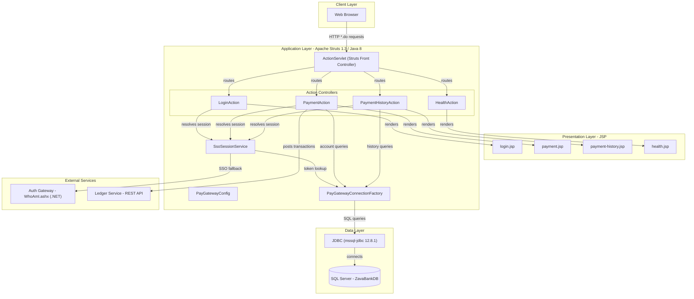
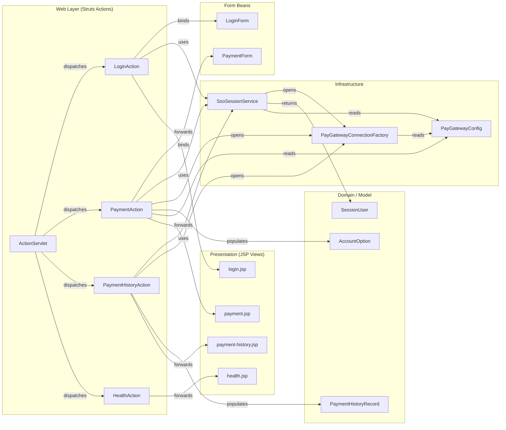

# Architecture Diagram

ZavaPayGateway is a Java EE web application built on Apache Struts 1.3 that provides a payment gateway interface for ZavaBank. It authenticates users via an external SSO service, retrieves account data from SQL Server, and posts transactions to a downstream Ledger microservice.

## Application Architecture

### Technology Stack Summary

| Layer | Technology | Version | Purpose |
|-------|-----------|---------|---------|
| Presentation | JSP (JavaServer Pages) | Servlet 3.1 | Server-rendered UI views |
| Web Framework | Apache Struts | 1.3.10 | MVC front-controller, routing, form binding |
| Web Framework | Apache Struts Taglib | 1.3.10 | JSP tag library for Struts forms |
| Runtime | Java SE | 1.8 | Application runtime language |
| Data Access | JDBC (mssql-jdbc) | 12.8.1.jre8 | Direct SQL Server connectivity |
| Build | Gradle | 8.9 | Build automation and dependency management |
| Packaging | WAR | — | Deployed as ROOT.war to servlet container |
| Server API | javax.servlet-api | 3.1.0 | Servlet container contract |

### Data Storage & External Services

The application uses **Microsoft SQL Server** (database `ZavaBankDB`, host `sqlserver:1433`) as its sole data store, accessed via raw JDBC through `PayGatewayConnectionFactory`. Tables queried include `SessionTokens`, `Users`, `Accounts`, and `PaymentHistory`. Two external HTTP services are consumed: the **Auth Gateway** (`zava-auth-gateway:8080/WhoAmI.ashx`), a .NET service used as a fallback SSO resolver when a `.ZAVAAUTH` cookie is present, and the **Ledger Service** (`zava-ledger:8080/api/transactions`), which receives XML-encoded payment transactions via HTTP POST.

### Key Architectural Decisions

- **Apache Struts 1.3 MVC pattern**: All HTTP requests matching `*.do` are handled by the Struts `ActionServlet`, which dispatches to concrete `Action` subclasses, providing a classic front-controller structure.
- **Direct JDBC with no ORM**: Data access uses raw `PreparedStatement` calls rather than JPA or any ORM, keeping the data layer thin but tightly coupled to SQL Server.
- **External SSO integration**: Session resolution is delegated to `SsoSessionService`, which first checks for an `X-Session-Token` header or local `SessionTokens` table, then falls back to calling the `.NET` Auth Gateway's `WhoAmI.ashx` endpoint via HTTP cookie forwarding.

## Component Relationships

### Component Inventory

| Component | Layer | Type | Responsibility |
|-----------|-------|------|---------------|
| ActionServlet | Web Layer | Struts Front Controller | Routes all `*.do` requests to the correct Action |
| LoginAction | Web Layer | Struts Action | Handles user login; validates session and redirects |
| PaymentAction | Web Layer | Struts Action | Displays payment form, loads accounts, submits transactions to ledger |
| PaymentHistoryAction | Web Layer | Struts Action | Retrieves and displays payment history for the current user |
| HealthAction | Web Layer | Struts Action | Provides a health-check endpoint |
| LoginForm | Form Beans | Struts ActionForm | Carries username/password fields from login form |
| PaymentForm | Form Beans | Struts ActionForm | Carries payment fields (from/to account, amount, note) |
| SsoSessionService | Infrastructure | Service | Resolves session tokens via DB lookup or Auth Gateway HTTP fallback |
| PayGatewayConnectionFactory | Infrastructure | Factory | Opens JDBC connections to SQL Server using config properties |
| PayGatewayConfig | Infrastructure | Configuration | Loads `paygateway.properties` and exposes typed accessors |
| SessionUser | Domain | Model / DTO | Carries authenticated user identity (userId, username) |
| AccountOption | Domain | Model / DTO | Represents a selectable bank account (id, number, type, balance) |
| PaymentHistoryRecord | Domain | Model / DTO | Represents a single payment history entry |
| login.jsp | Presentation | JSP View | Renders the login form |
| payment.jsp | Presentation | JSP View | Renders the payment submission form with account dropdowns |
| payment-history.jsp | Presentation | JSP View | Renders the tabular payment history |
| health.jsp | Presentation | JSP View | Renders the application health status |
