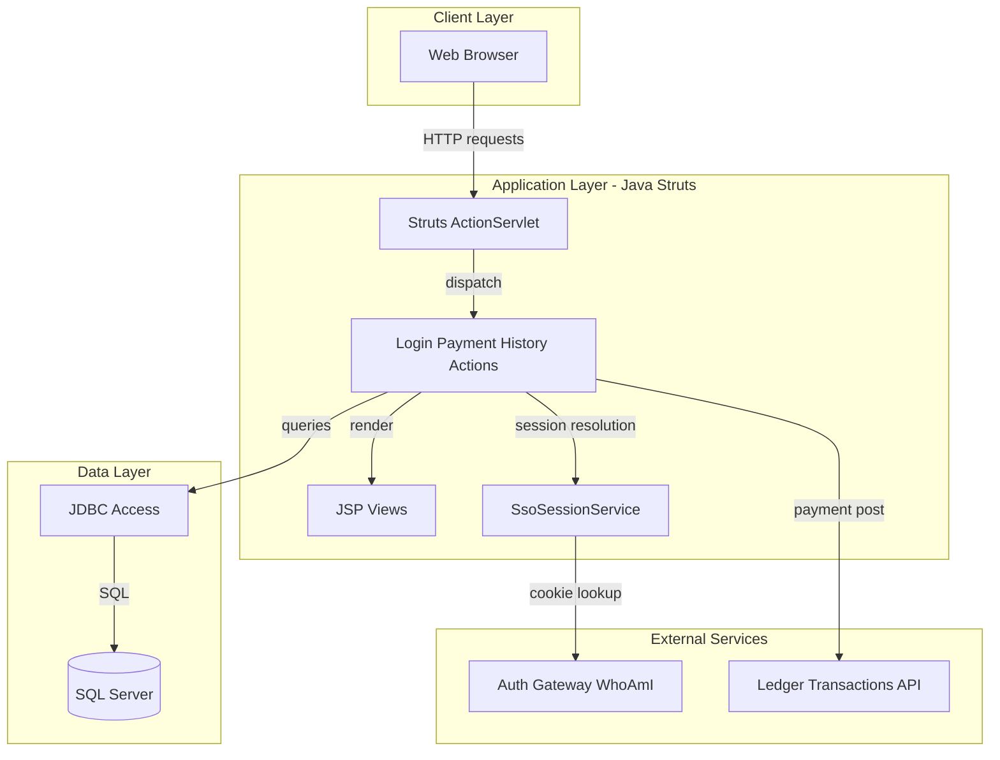
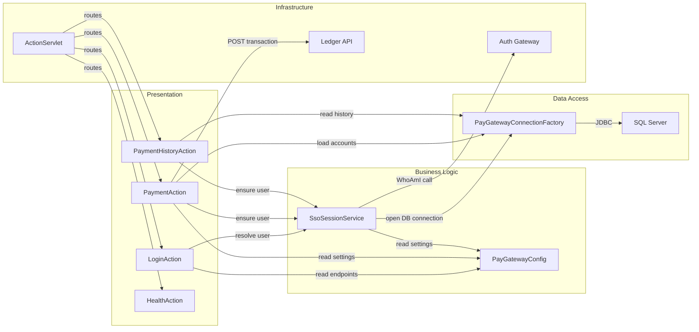

# Architecture Diagram

This application is a Java web gateway that handles login, payment submission, and payment history views using Struts actions and JSP pages.

## Application Architecture

### Technology Stack Summary

| Layer | Technology | Version | Purpose |
|---|---|---|---|
| Presentation | JSP + Struts ActionServlet | Struts 1.3.10 | Request handling and page rendering |
| Business | Java Action classes | Java 8 target | Login, payment posting, history retrieval |
| Data Access | JDBC + SQL Server Driver | mssql-jdbc 12.8.1.jre8 | Read accounts/history and validate sessions |
| External Integration | HTTP services | N/A | Auth token resolution and ledger posting |

### Data Storage & External Services

The application reads and writes operational payment data from SQL Server and integrates with two HTTP services: an authentication gateway for resolving session tokens and a ledger API for posting transaction entries.

### Key Architectural Decisions

- Uses classic Struts action mapping (`*.do`) with server-rendered JSP pages.
- Uses direct JDBC queries instead of repository abstractions.
- Delegates token resolution to a remote auth gateway when SSO cookie is present.

## Component Relationships

### Component Inventory

| Component | Layer | Type | Responsibility |
|---|---|---|---|
| ActionServlet | Infrastructure | Servlet | Dispatches `*.do` routes to Struts actions |
| LoginAction | Presentation | Struts Action | Handles token-based login and session initialization |
| PaymentAction | Presentation | Struts Action | Validates payment input and posts ledger transactions |
| PaymentHistoryAction | Presentation | Struts Action | Loads and renders recent payment history |
| SsoSessionService | Business Logic | Service | Resolves session user from token/cookie + DB |
| PayGatewayConnectionFactory | Data Access | Factory | Creates SQL Server JDBC connections |
| PayGatewayConfig | Business Logic | Config utility | Resolves environment/property-based settings |
