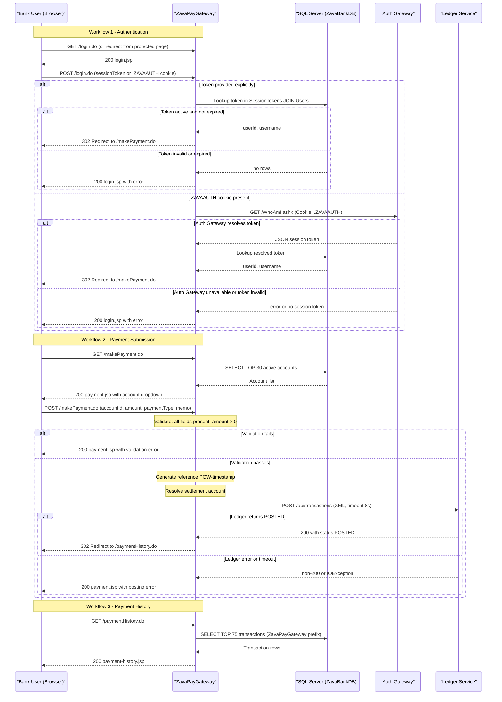

# Core Business Workflows

ZavaPayGateway provides ZavaBank customers with a web-based payment portal where they can authenticate via the bank's shared SSO system, submit payments (ACH, Bill Pay, Wire) against their bank accounts, and review their recent payment history.

## Domain Entities

| Entity | Service / Bounded Context | Description | Key Relationships |
|--------|--------------------------|-------------|------------------|
| User | Identity / Auth (Auth Gateway + ZavaBankDB) | An authenticated ZavaBank employee or customer who can initiate payments | Authenticated via session token; linked to one or more Accounts |
| SessionToken | Identity / Auth (ZavaBankDB) | A short-lived credential that proves a User has authenticated through ZavaAuthGateway | Belongs to one User; has an expiry; may be active or revoked |
| Account | Banking (ZavaBankDB) | A bank account with a type (ACH, checking, savings) and current balance | Belongs to a User; can be the source of a Transaction |
| AccountType | Banking (ZavaBankDB) | A classification of an Account (e.g., Checking, Savings) | Classifies one or many Accounts |
| Transaction | Ledger (Ledger Service + ZavaBankDB) | A completed payment movement between a debit account and a settlement account | Belongs to an Account; created by the Ledger Service; read back by ZavaPayGateway |

## Service-to-Domain Mapping

| Service | Domain Context | Owned Entities / Data | External Dependencies |
|---------|---------------|----------------------|----------------------|
| ZavaPayGateway | Payment Initiation | None (read-only consumer of shared DB) | Auth Gateway (SSO), Ledger Service (transaction write), SQL Server ZavaBankDB (read) |
| Auth Gateway (.NET, external) | Identity / Authentication | SSO session tokens (FormsAuth cookies) | ZavaBankDB `SessionTokens`, `Users` tables |
| Ledger Service (external) | Transaction Recording | `Transactions` table (write owner) | ZavaBankDB |
| ZavaBankDB (SQL Server) | Shared Data Store | All entities — Users, SessionTokens, Accounts, AccountTypes, Transactions | Shared across all services |

ZavaPayGateway owns no data and acts as an orchestrating consumer: it reads session, account, and transaction data from the shared database and delegates transaction writes to the Ledger Service.

## Primary Workflows

### Workflow 1: User Authentication (SSO Login)

A user lands on the payment portal and must prove their identity before accessing any protected feature.

**Steps:**

1. Browser is redirected to `/login.do` (from `index.jsp` or any protected page redirect).
2. The login form is displayed, prompting for a session token.
3. The user submits a session token. The token may be provided in three ways:
   - Form field (`sessionToken`)
   - Query parameter (`?sessionToken=…`)
   - HTTP header (`X-Session-Token`)
4. `LoginAction` calls `SsoSessionService.resolveSessionUser()` with the submitted token.
5. **Primary path**: `SsoSessionService` queries `SessionTokens JOIN Users` in SQL Server where `Token = ? AND IsActive = 1 AND ExpiresAt > GETDATE() AND u.IsActive = 1`.
   - If a matching active token is found → `SessionUser` (userId, username) is stored in `HttpSession` → redirect to `/makePayment.do`.
6. **SSO cookie fallback**: If no explicit token is provided and a `.ZAVAAUTH` cookie is present, `SsoSessionService` forwards the cookie to `Auth Gateway /WhoAmI.ashx` via HTTP GET. The Auth Gateway returns a JSON object containing a `sessionToken` field. That token is then looked up in the DB (step 5).
7. If neither path yields a valid user → `loginError` is set and `login.jsp` is re-rendered.

**Business rules**: Token must be active (`IsActive = 1`), not expired (`ExpiresAt > GETDATE()`), and the owning user must be active (`u.IsActive = 1`).

---

### Workflow 2: Payment Submission

An authenticated user selects a source account, enters an amount and payment type, and submits a payment.

**Steps:**

1. User navigates to `/makePayment.do` (GET). Session is validated; if invalid, redirected to login.
2. `PaymentAction` queries SQL Server for the top 30 active accounts (`Status = 'Active'`) and renders the payment form with the account dropdown populated.
3. User fills in: source account, amount, payment type (ACH / Bill Pay / Wire), and optional memo. Submits the form (POST `/makePayment.do`).
4. `PaymentAction` validates the submission:
   - Account ID, amount, and payment type must all be non-empty.
   - Amount must be parseable as a decimal (`BigDecimal`) and greater than zero.
5. A unique reference number is generated: `PGW-{System.currentTimeMillis()}`.
6. A settlement (credit) account ID is resolved from configuration (`ledger.settlement.account.id`). If the configured settlement account happens to equal the selected debit account, the fallback logic chooses account 2 (or 1 if the debit is already 2).
7. `PaymentAction.postToLedger()` sends an XML `<transactionRequest>` to the Ledger Service (`POST /api/transactions`) with a connect/read timeout of 8 seconds.
   - The `Description` field is encoded as `ZavaPayGateway:{paymentType}:{memo}` so history queries can filter and parse payment type.
8. If the Ledger Service responds with HTTP 200 **and** the body contains `<status>POSTED</status>` → success:
   - A confirmation message is set (reference number + amount).
   - User is redirected to `/paymentHistory.do`.
9. If the Ledger Service is unreachable, times out, returns non-200, or does not contain `<status>POSTED</status>` → error:
   - `statusError` attribute is set ("Unable to post payment to ZavaLedger.").
   - Payment form is re-rendered. No retry is attempted.

---

### Workflow 3: Payment History View

An authenticated user reviews their recent payment activity.

**Steps:**

1. User navigates to `/paymentHistory.do` (GET). Session is validated.
2. `PaymentHistoryAction` queries the `Transactions JOIN Accounts` table for the 75 most recent transactions where `Description LIKE 'ZavaPayGateway:%'`, ordered by `TransactionDate DESC`.
3. The `paymentType` is extracted from the `Description` field by splitting on `:` and taking the second segment.
4. Results are rendered in a table showing: Transaction ID, Account Number, Amount, Payment Type, Reference Number, Transaction Date, and Status.

---

### Workflow 4: Health Check

The `/health.do` endpoint returns a static HTML page confirming the servlet is running. No business logic, database access, or authentication is involved.

## Cross-Service Data Flows

ZavaPayGateway orchestrates two cross-service flows:

**1. Session Resolution (SSO Cookie path)**:
Browser → `ZavaPayGateway (SsoSessionService)` → `Auth Gateway (WhoAmI.ashx)` → returns `sessionToken` → `ZavaPayGateway` → `SQL Server (SessionTokens JOIN Users)` → returns `SessionUser`. If the Auth Gateway is unavailable (IOException or non-200 response), the entire SSO-cookie login path fails silently; the user sees "Session token was not found or has expired." No fallback identity is established.

**2. Payment Submission (Ledger delegation)**:
Browser → `ZavaPayGateway (PaymentAction)` → `Ledger Service (POST /api/transactions)` → Ledger writes to `Transactions` table → returns `<status>POSTED</status>`. `ZavaPayGateway` then reads the transaction back indirectly by redirecting to the Payment History page, which queries the `Transactions` table directly. If the Ledger Service is unavailable, the payment is dropped silently (no retry, no queue, no compensating action).

## Business Workflow Sequence

## Business Rules & Decision Logic

### Validation Rules

| Rule | Location | Condition | Outcome on Failure |
|------|----------|-----------|-------------------|
| Required fields | `PaymentAction` | Account ID, amount, and payment type must all be non-empty | Re-render form with "Please select an account, amount, and payment type." |
| Positive amount | `PaymentAction` | Amount parsed as `BigDecimal` must be > 0 | Re-render form with "Payment amount must be greater than zero." |
| Numeric format | `PaymentAction` | Amount must be parseable as a decimal; account ID as an integer | Re-render form with "Amount or account format is invalid." |
| Active session token | `SsoSessionService` | Token must exist in DB, `IsActive = 1`, `ExpiresAt > GETDATE()`, and user `IsActive = 1` | Redirect to `/login.do` |

### Decision Logic

- **Settlement account avoidance**: If the configured settlement account ID equals the user-selected debit account, the system picks account 2 as the settlement account (or account 1 if debit is account 2). This prevents a self-transfer.
- **Payment type encoding in Description**: The `Description` field sent to the Ledger Service is formatted as `ZavaPayGateway:{paymentType}:{memo}`. On the history read, the payment type is parsed back out by splitting on `:`. This is the only coupling mechanism between the write path (Ledger) and the read path (ZavaPayGateway history query).
- **Ledger success detection**: Payment is considered posted only if the Ledger Service returns HTTP 200 **and** the response body string-contains `<status>POSTED</status>`. Any other response is treated as failure.

### State Transitions

| Entity | States | Transition Trigger |
|--------|--------|-------------------|
| SessionToken | Active → Expired | Time passes beyond `ExpiresAt` (managed by Auth Gateway / DB) |
| Transaction | (none in ZavaPayGateway) | Ledger Service owns the transaction lifecycle; ZavaPayGateway only reads the resulting `Status` field |

### Transaction Boundaries

No explicit transaction management (`@Transactional` or JDBC `setAutoCommit(false)`) is used. Each database query is a single auto-committed statement. There is no compensating transaction if the Ledger Service call succeeds but a subsequent DB read fails.

### Error Handling

- All `SQLException` instances are **silently swallowed** (`catch (SQLException ignored)`). If a DB query fails, the account list or history list is returned empty with no error surfaced to the user.
- All `IOException` instances in `postToLedger` are silently swallowed; the method returns `false`, resulting in a user-visible "Unable to post payment" error.
- There is no structured logging, no error monitoring, and no alerting for any failure path.

### Authorization

Session validation (`ensureUserSession`) is performed inline at the start of `PaymentAction.execute()` and `PaymentHistoryAction.execute()`. If the `HttpSession` contains a valid `SessionUser`, the user proceeds; otherwise they are redirected to login. There is no role-based access control; all authenticated users have equal access to all accounts shown in the dropdown.
