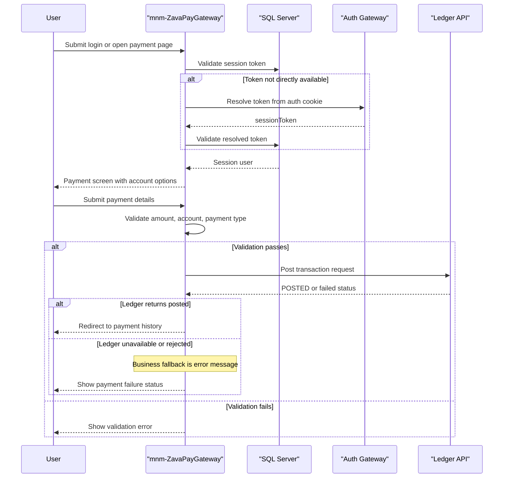

# Core Business Workflows

The application supports user session validation and payment posting workflows for banking operations, with supporting history and health flows.

## Domain Entities

| Entity | Service / Bounded Context | Description | Key Relationships |
|---|---|---|---|
| SessionUser | Session and Access | Authenticated user context used by actions | Derived from SessionTokens and Users data |
| AccountOption | Payment | Represents selectable debit account details | Sourced from Accounts and AccountTypes |
| PaymentForm | Payment | Captures payment instruction input | Drives ledger posting request |
| PaymentHistoryRecord | Payment History | Represents rendered historical payment entry | Built from Transactions joined to Accounts |

## Service-to-Domain Mapping

| Service | Domain Context | Owned Entities | External Dependencies |
|---|---|---|---|
| mnm-ZavaPayGateway | Session and Payments | SessionUser, PaymentForm, AccountOption, PaymentHistoryRecord | SQL Server, zava-auth-gateway, zava-ledger |

## Primary Workflows

### Workflow 1: Authenticate session and enter payment flow

User opens or submits login. The app resolves a token from form/header/cookie, validates it against active unexpired token data, and stores `SessionUser` in HTTP session before redirecting to payment screen.

### Workflow 2: Submit payment and record outcome

User submits account, amount, and payment type. The app validates required values and positive amount, builds a reference number, posts XML transaction payload to ledger, and then either redirects to history on success or shows an error.

### Workflow 3: View payment history

Authenticated user requests history. The app queries recent `ZavaPayGateway` transactions, formats them for display, and renders JSP output.

## Cross-Service Data Flows

Gateway logic composes local SQL data (accounts, sessions, history) with remote calls: auth gateway resolves cookie-based session token, and ledger API accepts payment transactions. If remote services fail, business outcomes degrade by blocking login fallback or payment posting while still preserving local page rendering.

## Business Workflow Sequence

## Business Rules & Decision Logic

- User session must be present or resolvable before payment and history access.
- Payment amount must parse as a positive decimal value.
- Account, amount, and payment type are required for payment submission.
- Settlement account must differ from selected debit account.
- Payment is considered successful only when downstream response contains posted status.
