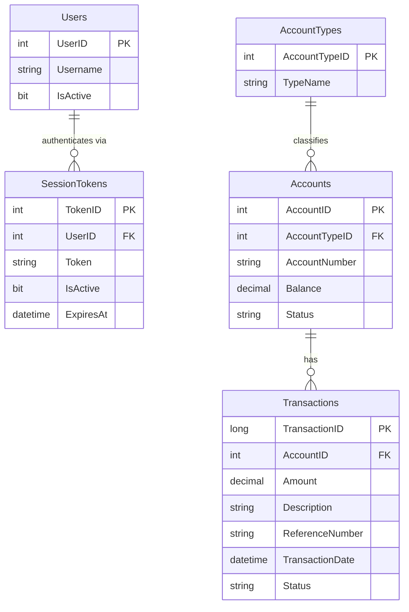

# Data Architecture & Persistence Layer

ZavaPayGateway persists all data in a single Microsoft SQL Server database (`ZavaBankDB`) accessed exclusively through raw JDBC — there is no ORM framework, no schema migration tooling, and no caching layer.

## Database Configuration

| Service / Module | DB Type | Profile | Driver | Connection | Migration Tool |
|-----------------|---------|---------|--------|------------|----------------|
| ZavaPayGateway | Microsoft SQL Server | Single (no profiles) | mssql-jdbc 12.8.1.jre8 (loaded via `Class.forName`) | `sqlserver:1433`, database `ZavaBankDB`, user `sa` | None — schema is managed externally; the application only reads/writes pre-existing tables |

Connection pooling: None declared. Every operation calls `DriverManager.getConnection(...)` directly, opening a new physical connection per request. There is no HikariCP, DBCP, or other pool configured.

Schema management: The application does not create or alter tables. DDL is expected to exist before deployment. No Flyway, Liquibase, or equivalent migration tool is present.

## Data Ownership per Service

| Service | Tables Owned (Read/Write) | Tables Read-Only | ORM Framework | Caching | Notes |
|---------|--------------------------|-----------------|---------------|---------|-------|
| ZavaPayGateway | Transactions (INSERT via Ledger), Accounts (SELECT) | SessionTokens, Users, AccountTypes | None — raw JDBC | None | Transactions are not written directly; they are submitted to the external Ledger Service via HTTP, which writes to the DB. ZavaPayGateway reads them back via SELECT on the `Transactions` table. |

## Entity Model

> Note: The application uses no JPA/ORM entities. The ER diagram below reflects the database tables as inferred from the SQL queries in the source code.

**Java read-model classes** (not JPA entities — populated from `ResultSet`):

| Class | Source | Fields |
|-------|--------|--------|
| `AccountOption` | `AccountOption.java` | `accountId`, `accountNumber`, `accountType`, `balance` (String) |
| `PaymentHistoryRecord` | `PaymentHistoryRecord.java` | `transactionId`, `accountNumber`, `amount`, `paymentType`, `referenceNumber`, `transactionDate`, `status` |
| `SessionUser` | `SessionUser.java` | `userId`, `username` |

None of these classes carry persistence annotations; they are plain mutable JavaBeans used as view-transfer objects.

## Key Repository Methods

There are no repository interfaces or DAO classes. All data access is performed inline within Action classes using raw JDBC `PreparedStatement`. The table below documents the effective query methods:

| Caller Class | Effective Operation | SQL Pattern | Purpose |
|-------------|--------------------|----|---------|
| `SsoSessionService` | `resolveSessionUser(request, token)` | `SELECT TOP 1 st.UserID, u.Username FROM SessionTokens st INNER JOIN Users u ON st.UserID = u.UserID WHERE st.Token = ? AND st.IsActive = 1 AND st.ExpiresAt > GETDATE() AND u.IsActive = 1` | Resolves a session token string to an authenticated `SessionUser`; checks token validity and user active status |
| `PaymentAction` | `loadAccounts()` | `SELECT TOP 30 a.AccountID, a.AccountNumber, at.TypeName, a.Balance FROM Accounts a INNER JOIN AccountTypes at ON a.AccountTypeID = at.AccountTypeID WHERE a.Status = 'Active' ORDER BY a.AccountNumber` | Loads active accounts for the payment form dropdown; returns top 30 by account number |
| `PaymentHistoryAction` | `readHistory()` | `SELECT TOP 75 t.TransactionID, a.AccountNumber, t.Amount, t.Description, t.ReferenceNumber, t.TransactionDate, t.Status FROM Transactions t INNER JOIN Accounts a ON t.AccountID = a.AccountID WHERE t.Description LIKE 'ZavaPayGateway:%' ORDER BY t.TransactionDate DESC` | Reads the 75 most recent transactions that originated from ZavaPayGateway (identified by the `ZavaPayGateway:` prefix in `Description`) |

No `@Transactional` annotations or programmatic transaction management is used; each SQL operation is a single auto-committed statement.

## Caching Strategy

No caching layer is implemented. Every request that requires account data or transaction history executes a new database query over a new JDBC connection. There is no Spring Cache (`@Cacheable`), Redis, EhCache, or any in-memory caching provider configured.

Additionally, account list results are not cached between page loads; the `loadAccounts()` query fires on every GET request to `/makePayment.do`.

## Data Ownership Boundaries

**Shared data store**: ZavaPayGateway shares the `ZavaBankDB` SQL Server database with the external Ledger Service and the Auth Gateway. There is no logical separation (separate schemas, row-level security) between the services within the database. The application relies on the Ledger Service to write transaction records and then reads them back directly from the `Transactions` table, creating a tight coupling through the shared database.

**Cross-service data access**: ZavaPayGateway reads directly from tables owned by other services (`Transactions`, `SessionTokens`) without going through a service API. This shared-database anti-pattern means schema changes in any upstream service (Ledger, Auth Gateway) will break ZavaPayGateway without any API versioning contract.

**Write patterns**: ZavaPayGateway is predominantly read-only against the database. The only write path is indirect: a POST to `/makePayment.do` triggers an HTTP call to the Ledger Service, which writes to `Transactions`. ZavaPayGateway has no INSERT/UPDATE/DELETE statements in its own codebase.

### Data Classification & Sensitivity

| Table / Field | Sensitive Fields | Classification | Controls in Place |
|--------------|-----------------|---------------|-------------------|
| `Users` | `Username` | PII (account identifier) | None — no encryption-at-rest, no masking |
| `SessionTokens` | `Token` | Credentials / Security-sensitive | No hashing or encryption; tokens stored as plain-text strings; active token compromise grants full access |
| `Accounts` | `AccountNumber`, `Balance` | PCI-adjacent (financial account data) | None — no field-level encryption, no masking in queries |
| `Transactions` | `Amount`, `ReferenceNumber` | PCI-adjacent (financial transaction data) | None — no encryption-at-rest, no audit trail in the application layer |
| `paygateway.properties` | `db.password` (`Zava123!`) | Credentials | Hard-coded plaintext password in a committed properties file — critical security gap |

**Summary**: Session tokens are stored as plain-text strings in the database with no hashing. Financial account numbers and balances are exposed in query results without masking. The database password is hard-coded in `paygateway.properties` which is committed to source control. No encryption-at-rest, no masking, and no field-level access controls are configured at the application layer.
