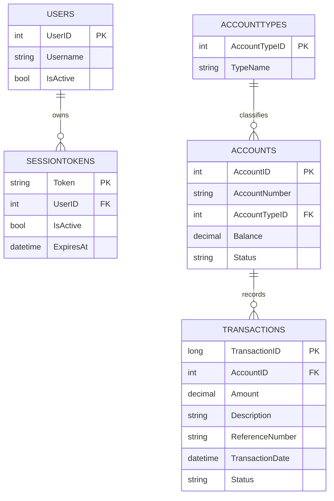

# Data Architecture & Persistence Layer

The data layer is centered on a SQL Server schema accessed through direct JDBC statements, with no ORM entity framework in use.

## Database Configuration

| Service/Module | DB Type | Profile | Driver | Connection | Migration Tool |
|---|---|---|---|---|---|
| mnm-ZavaPayGateway | SQL Server | default | com.microsoft.sqlserver:mssql-jdbc:12.8.1.jre8 | `jdbc:sqlserver://<host>:<port>;databaseName=<name>` | none detected |

## Data Ownership per Service

| Service | Tables Owned | ORM Framework | Caching | Notes |
|---|---|---|---|---|
| mnm-ZavaPayGateway | SessionTokens, Users, Accounts, AccountTypes, Transactions (read/write by queries) | JDBC | none | Single shared operational database |

## Entity Model

## Key Repository Methods

| Service | Repository | Notable Methods | Purpose |
|---|---|---|---|
| mnm-ZavaPayGateway | `SsoSessionService` (inline JDBC) | token lookup query with active/expiry filters | Resolve authenticated session user |
| mnm-ZavaPayGateway | `PaymentAction` (inline JDBC) | load top 30 active accounts query | Populate payment form options |
| mnm-ZavaPayGateway | `PaymentHistoryAction` (inline JDBC) | load top 75 gateway transactions query | Display payment history |

## Caching Strategy

No explicit caching provider, cache annotations, or cache-side patterns were detected. The application depends on direct DB reads per request.

## Data Ownership Boundaries

The application uses a shared SQL Server database and performs all reads locally via JDBC. Cross-service data exchange happens through HTTP integrations (auth and ledger) rather than cross-database joins, while transaction state is still persisted centrally in SQL Server.

### Data Classification & Sensitivity

| Entity | Sensitive Fields | Classification (PII/PHI/PCI/None) | Controls in Place |
|---|---|---|---|
| Users | Username | PII | No explicit encryption/masking in code |
| SessionTokens | Token | PII | Token expiry and active checks; no masking/encryption-at-rest evidence |
| Accounts | AccountNumber, Balance | PII | No explicit masking in code |
| Transactions | Description, ReferenceNumber | PII | No explicit field-level control shown |
