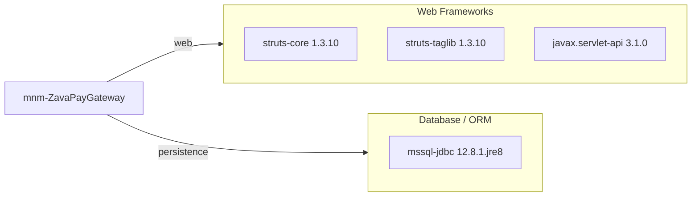

# Dependency Map

This project declares 4 runtime dependencies in a single Gradle module for a Struts-based Java web application.

## Dependencies

### Dependency Summary

| Category | Count | Key Libraries | Notes |
|---|---:|---|---|
| Web Frameworks | 3 | Struts Core, Struts Taglib, Servlet API | Legacy Struts MVC stack |
| Database / ORM | 1 | Microsoft SQL Server JDBC Driver | Direct JDBC access |

### Version & Compatibility Risks

Struts 1.3.10 is a legacy framework with known long-term maintenance and modernization risk; migration to a supported web framework will likely require controller and view-layer refactoring.

### Notable Observations

- No explicit logging framework dependency is declared.
- No resilience or observability libraries are declared in build dependencies.
- Dependency footprint is small, with no test dependencies currently declared.

## Test Dependencies

No test dependencies detected.

Total test-scope dependencies: 0
No dedicated test framework is currently declared in build dependencies.
