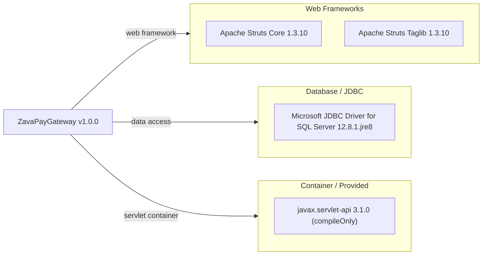

# Dependency Map

ZavaPayGateway is a single-module Gradle Java project with 4 declared external dependencies covering the web framework, database driver, and servlet container contract.

## Dependencies

### Dependency Summary

| Category | Count | Key Libraries | Notes |
|----------|-------|---------------|-------|
| Web Frameworks | 2 | Apache Struts Core 1.3.10, Apache Struts Taglib 1.3.10 | Legacy Struts 1 MVC framework; end-of-life since 2013 |
| Database / JDBC | 1 | Microsoft JDBC Driver for SQL Server 12.8.1.jre8 | Modern JDBC driver; targets JRE 8 |
| Container / Provided | 1 | javax.servlet-api 3.1.0 | Provided by servlet container at runtime (compileOnly scope) |

### Version & Compatibility Risks

**Apache Struts 1.3.10** reached end-of-life in December 2013 and has not received security updates or feature additions since then. Multiple CVEs (including critical remote-code-execution vulnerabilities in the Struts 1 ecosystem) have been published over the years with no patches available. The `javax.servlet-api 3.1.0` is tied to the older `javax.*` namespace (Java EE 7 era), which was superseded by `jakarta.servlet-api` under Jakarta EE 9+; migrating to a modern servlet container (Tomcat 10+, Jetty 11+) will require a namespace migration. The Microsoft JDBC driver `12.8.1.jre8` is current but targets JRE 8, which itself is in paid-support-only territory for most distributions.

### Notable Observations

- **End-of-life web framework**: Apache Struts 1 has been unsupported for over a decade. The entire MVC layer (Actions, ActionForms, struts-config.xml) must be rewritten to migrate to a supported framework (Spring MVC, Jakarta EE MVC, Quarkus, etc.).
- **Minimal dependency footprint**: The application has only 4 declared dependencies with no logging, security, caching, or observability libraries. Cross-cutting concerns are handled through the servlet container or are absent, making cloud observability a gap that will need to be addressed during modernization.
- **No BOM or version catalog**: Versions are hard-coded directly in `build.gradle` with no BOM import or Gradle version catalog, increasing the maintenance burden when updating dependencies.
- **javax vs. jakarta namespace split**: Both the servlet API and Struts 1 use the old `javax.*` namespace. Any migration to Jakarta EE 9+ or Spring Boot 3+ will require a `javax` → `jakarta` package rename across all source files.

## Test Dependencies

No test-scoped dependencies are declared in `build.gradle`. There are no test source files in the repository.

Total test-scope dependencies: 0

No test framework is configured for this project. Adding a testing framework (e.g., JUnit 5 with Mockito) should be considered as part of any modernization effort to enable automated regression testing for the business logic being migrated.
